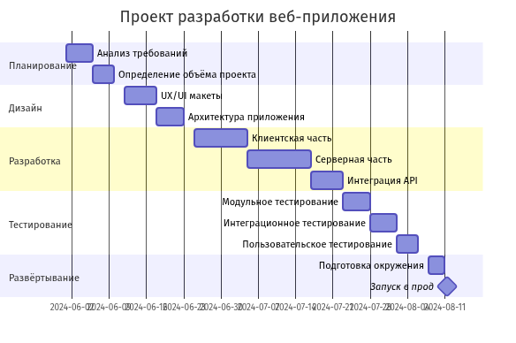

# 🤖 Mermaid AI

[](https://www.python.org/downloads/)
[](https://github.com/your-username/mermaid-ai)
[](https://github.com/astral-sh/uv)
[](https://docs.astral.sh/ruff/)
[](https://www.docker.com/)

**Command-line утилита для создания Mermaid-диаграмм с помощью AI.** На вход подаётся текстовое описание задачи по
созданию диаграммы; на выходе — **PNG-файл** с готовой диаграммой.

Пример запроса: *«Создай диаграмму Ганта в формате Mermaid для небольшого проекта разработки веб-приложения. Включи
основные этапы: планирование, дизайн, разработку, тестирование и развёртывание.»* — программа сгенерирует Mermaid-код
через LLM и отрендерит его в PNG через [Kroki](https://kroki.io).

### Пример результата

Ниже — пример PNG-диаграммы, полученной по такому запросу:



---

## ✨ Возможности

- **Интерактивный режим** — вводите описание в консоль, получаете `diagram.png`
- **Поддержка типов диаграмм** — flowchart, sequence, gantt, class, state и др.
- **Рендер в PNG** — через Kroki API (без локального Chromium)
- **Гибкая настройка** — переменные окружения или `.env`
- **Логирование в отдельный файл** — логи пишутся в файл (например, `mermaid_ai.log`) с ротацией
- **Docker** — готовый образ

---

## 🛠 Технологический стек

| Категория                    | Технологии                                                                                              |
|------------------------------|---------------------------------------------------------------------------------------------------------|
| **Язык и среда**             | Python 3.13+                                                                                            |
| **Управление зависимостями** | [uv](https://github.com/astral-sh/uv)                                                                   |
| **LLM API**                  | [OpenAI Python SDK](https://github.com/openai/openai-python) (совместим с любым OpenAI-совместимым API) |
| **HTTP-клиент**              | [requests](https://requests.readthedocs.io/)                                                            |
| **Конфигурация**             | [python-dotenv](https://github.com/theskumar/python-dotenv)                                             |
| **Логирование**              | Стандартная библиотека `logging`                                                                        |
| **Линтинг и форматирование** | [Ruff](https://docs.astral.sh/ruff/)                                                                    |
| **Контейнеризация**          | Docker                                                                                                  |
| **Внешние сервисы**          | [Kroki](https://kroki.io) (рендер Mermaid → PNG)                                                        |

---

## 📁 Структура проекта

```
mermaid-ai/
├── app/
│   ├── cli.py          # Точка входа, интерактивный бот
│   ├── ai_client.py    # Запросы к LLM, генерация Mermaid
│   ├── kroki_client.py # Рендер Mermaid → PNG через Kroki
│   ├── settings.py     # Настройки из .env / окружения
│   ├── validators.py   # Валидация Mermaid-кода
│   ├── exceptions.py   # Исключения приложения
│   └── logger.py       # Логирование
├── Dockerfile
├── pyproject.toml
├── uv.lock
└── README.md
```

## 🔄 Схема работы утилиты


## 🚀 Установка и запуск

### Скачиваем проект

```bash
git clone https://github.com/your-username/mermaid-ai.git
cd mermaid-ai
```

### Собираем Docker образ

```bash
docker build -t mermaid-ai .
```

### Запускаем Docker контейнер

```bash
docker run --rm -it \
    --env-file .env \
    -v /path/on/host:/app/output \
    mermaid-ai
```

